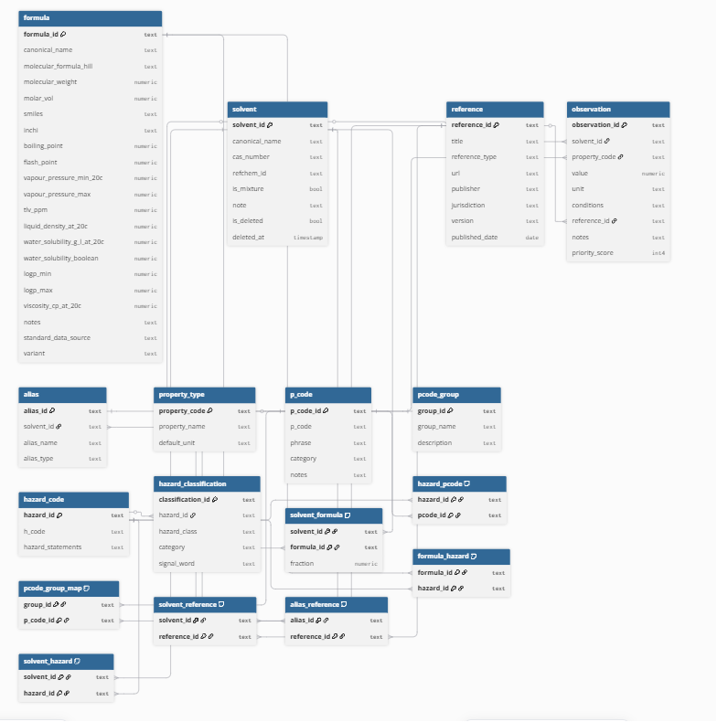

# Solvent substitution calculator #

*A tool for choosing appropriate solvents with given parameters, prioritising risk mitigation and operator health. The database is designed to model solvent products (dilutions, mixes) mapping to one or more chemical formulas, which determine hazards and precautions.*

## Relational map ##

### 🟦 CORE LAYER (identity + data capture) ###

solvent

  │

  ├── alias

  ├── observation

  └── solvent_reference

Purpose:
- what the product is called or was historically known as (useful when searching for case studies)
- what properties have been measured/reported
- what sources support the data

### 🟨 COMPOSITION LAYER (chemical truth) ###

solvent

  │

  └── solvent_formula ──────── formula

Meaning:
- solvent = commercial entity (white spirit, lab solvent, etc.) or other chemical formulation
- formula = chemical identity (hexane, pentane, mixtures); may be constituent of solvents
- solvent_formula = mapping + optional composition fraction

### 🟥 HAZARD LAYER (regulatory classification) ###

formula
 
  │

  ├── formula_hazard ─────── hazard_code ─────── hazard_classification

  └────────────────────────── hazard_pcode ───── p_code

Meaning:
- formula determines hazard truth
- hazard_code defines H-statements
- classification refines category/strength
- p_code defines required precautions

_Hazard statements and regulations vary between territories. By default I have used the latest available European MSDS, providing links. Tables are designed so that any element of the safety framework can be changed easily with minimal updates. This future-proofs a rapidly changing sector (i.e. recent regulatory changes for use of benzene in NZ), and expedites making localised versions_

### 🟪 ORGANISATION LAYER (usability grouping) ###

p_code ───── pcode_group_map ───── pcode_group

Meaning:
structural grouping for UI, filtering, or reporting; 
this does not affect hazard logic

## End-to-end flow ## 

On querying a solvent:

SOLVENT
  ↓
solvent_formula
  ↓
FORMULA (canonical properties of constituent chemicals)
  ↓
formula_hazard
  ↓
HAZARD_CODE
  ↓
hazard_pcode
  ↓
P_CODE

The full chain is: Product → composition → hazard → precaution

This is important because trade names are used inconsistently. White spirit from one supplier may be predominantly hexane, while another uses a pentane base.

The system handles it as:
solvent (White Spirit A)
  → solvent_formula → hexane

solvent (White Spirit B)
  → solvent_formula → pentane

Then:

hexane → hazards → P-codes
pentane → hazards → P-codes

### Why this architecture? ###
Commercial solvent names are inconsistent and often misleading. By normalising trade names to chemical formulas before applying regulatory hazards, this system ensures that safety reporting is driven by chemical composition. This also increases the likelihood of sourcing local compliance documentation.

## 🗺️ Roadmap ##
My goal is to evolve this from a data-lookup tool with basic HSP modelling into a comprehensive decision support system.

Proposed features include:
- Visualisation Engine: Graphical representation of solubulity parameters and hazard profiles to enable quick comparisons between potential solvent choices.

- Multi-Component Modelling: Scaling the solvent_formula logic to handle three or more blends simultaneously (calculating the aggregate hazard profile).

- Advanced Carriers: Incorporating data on solvents within gels, binders, and other delivery systems. Carriers increase duration of contact with a substrate, so that less solvent is necessary - reducing risk to individual and object.

- Interaction Logic: Adding support for identifying synergists and antagonists to flag potential reactivity or efficacy changes when blending chemicals.

- The database schema is designed to scale; eventually factors such as heat or air pressure could be factored into calculations.